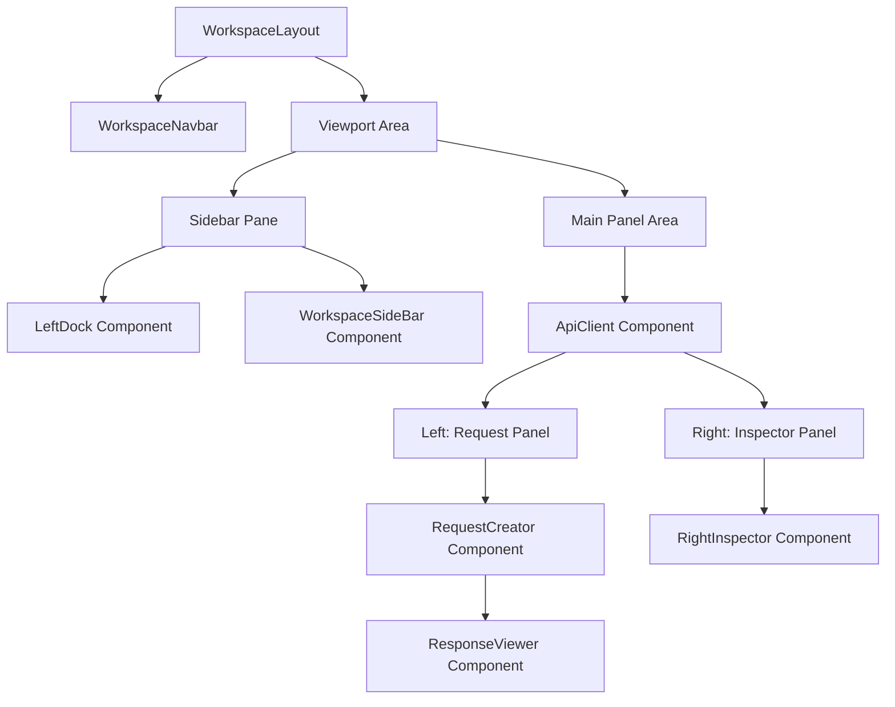

# Anvaya-Lab: UI Architecture & Component Structure

This document details the hierarchical layout, file structuring, and component architecture of the Anvaya-Lab API Client workspace.

---

## 1. Architectural Layout Overview

Anvaya-Lab is structured as a single-viewport dashboard utilizing Next.js, React, Tailwind CSS, and Framer Motion. The layout enforces a strict split-pane design using flex alignments and fixed bounds, preventing layout shifts during network fetches and page renders.

---

## 2. Component Directory Structure

All client interface elements reside under `src/components` and `src/app`:

*   **`src/app/(app)/my-workspace/`**: Page container and context loaders.
    *   [layout.tsx](file:///d:/Code%20Playground/anvaya-lab/src/app/(app)/my-workspace/layout.tsx): Root wrapper containing session, user, and layout viewports.
    *   [page.tsx](file:///d:/Code%20Playground/anvaya-lab/src/app/(app)/my-workspace/page.tsx): Suspends and mounts the central `ApiClient` view.
*   **`src/components/main-layout/`**: Workspace frame components.
    *   [WorkspaceNavbar.tsx](file:///d:/Code%20Playground/anvaya-lab/src/components/main-layout/WorkspaceNavbar.tsx): Top header navigation panel.
    *   [LeftDock.tsx](file:///d:/Code%20Playground/anvaya-lab/src/components/main-layout/LeftDock.tsx): Vertical navigation bar switcher.
    *   [WorkspaceSideBar.tsx](file:///d:/Code%20Playground/anvaya-lab/src/components/main-layout/WorkspaceSideBar.tsx): Hierarchical directory tree of collections and requests.
*   **`src/components/settings/`**: Settings management.
    *   [SettingsManager.tsx](file:///d:/Code%20Playground/anvaya-lab/src/components/settings/SettingsManager.tsx): Workspace configurations and credentials action panel.
*   **`src/components/ApiClient/`**: Sandbox execution panel.
    *   [ApiClient.tsx](file:///d:/Code%20Playground/anvaya-lab/src/components/ApiClient/ApiClient.tsx): State routing coordinator (Empty landing vs. Sandbox creator).
    *   [RequestCreator.tsx](file:///d:/Code%20Playground/anvaya-lab/src/components/ApiClient/RequestCreator.tsx): Request configuration tabbed sandbox panel.
    *   [ResponseViewer.tsx](file:///d:/Code%20Playground/anvaya-lab/src/components/ApiClient/ResponseViewer.tsx): Static-height output drawer.
    *   [RightInspector.tsx](file:///d:/Code%20Playground/anvaya-lab/src/components/ApiClient/RightInspector.tsx): Side utility pane (Snippets, Globals, History).

---

## 3. UI Component Hierarchical Breakdown

### A. Main App Shell (`WorkspaceLayout` & `WorkspaceNavbar`)
*   **`SessionProvider` & `UserProvider`**: Context wrappers managing authenticated state and central sandbox data synchronization.
*   **`WorkspaceNavbar`**: Top-aligned headers container (`h-12` px).
    *   **Branding Logo**: Aspect-ratio locked logo image (`/navBar_logo.png`).
    *   **User Action Trigger**: Spring-animated user menu dropdown showing active profile avatar, settings, and sign-out command.

### B. Navigation & Collection Sidebar (`LeftDock` & `WorkspaceSideBar`)
*   **`LeftDock`**: Leftmost navigation ribbon (`w-12` px) showing workspace section switches (API Client, Analytics, Environments) and settings.
*   **`WorkspaceSideBar`**: Sidebar list (`w-60` px) managing:
    *   **Create Trigger Buttons**: Add new folders, collection nodes, or individual HTTP requests.
    *   **Collections List**: Interactive accordion files displaying request trees that route navigation parameters to the URL query string (`?reqId={id}`).

### C. Active Work Sandbox (`ApiClient` & `RequestCreator`)
If a request is loaded via `reqId`, `ApiClient` mounts the core sandbox components:

1.  **Request Header Info**:
    *   `InlineEdit` (Title): Click-to-edit input field changing request titles.
    *   `InlineEdit` (Description): Subtext editor describing the request.
    *   **Auto-Save Badge**: Reacts dynamically to DB synchronization state:
        *   `Saving...`: Spin animation showing ongoing Axios PATCH operations.
        *   `Saved`: Success badge verifying backend database persistence.
        *   `Save Failed`: Danger badge flagging Zod schema validation locks.
        *   `Unsaved`: Inactive background state.
2.  **HTTP Request Command Bar**:
    *   **Method Selector Dropdown**: Custom popover changing HTTP methods (`GET`, `POST`, `PUT`, `PATCH`, `DELETE`) with signature color dots.
    *   **Endpoint Address Field**: Globe-prepended address text input sync-updating URL parameters.
    *   **Action Button**: Split button triggering requests execution, showing animators during fetching.
3.  **Request Parameter Configuration Tabs**:
    *   **Query Params**: Key-value table mapping URL arguments with active checkboxes.
    *   **HTTP Headers**: Key-value table mapping custom request header objects.
    *   **Authorization Helper**: Toggle selectors configuring token parameters (No Auth, Bearer Token, API Key).
    *   **Request Body Editor**: Content-type dropdown selector (JSON, Form-urlencoded, Raw, None) paired with a styled text editor featuring scroll-locked line number guides and beautifying helpers.

### D. Response Results Drawer (`ResponseViewer`)
Located at the base of the sandbox panel, enforcing a rigid `h-[200px]` footprint to lock layout heights:

*   **Status Panel**: Execution metrics showing HTTP status codes, latency timings (e.g., `45ms`), and payload sizes.
*   **Response Tabs Selector**: Toggle buttons (Pretty, Raw, Headers, and JSON downloads).
*   **Output Viewer**:
    *   **Pretty & Raw Tabs**: Asynchronous code highlights formatted with Shiki's high-contrast theme (`github-dark-high-contrast`) and wrapping configurations (`pre-wrap`).
    *   **Headers Tab**: Key-value metadata table mapping response headers.

### E. Integrations Sidebar (`RightInspector`)
Side panel (`w-75` px) containing utility tabs:

*   **Code Snippets**: Renders code output templates (cURL, Fetch, Axios, Python, Go) highlighted in real-time by Shiki.
*   **ENVs**: Quick look utility mapping active environment variables with secret mask toggles.
*   **History**: Log listing past request executions.
